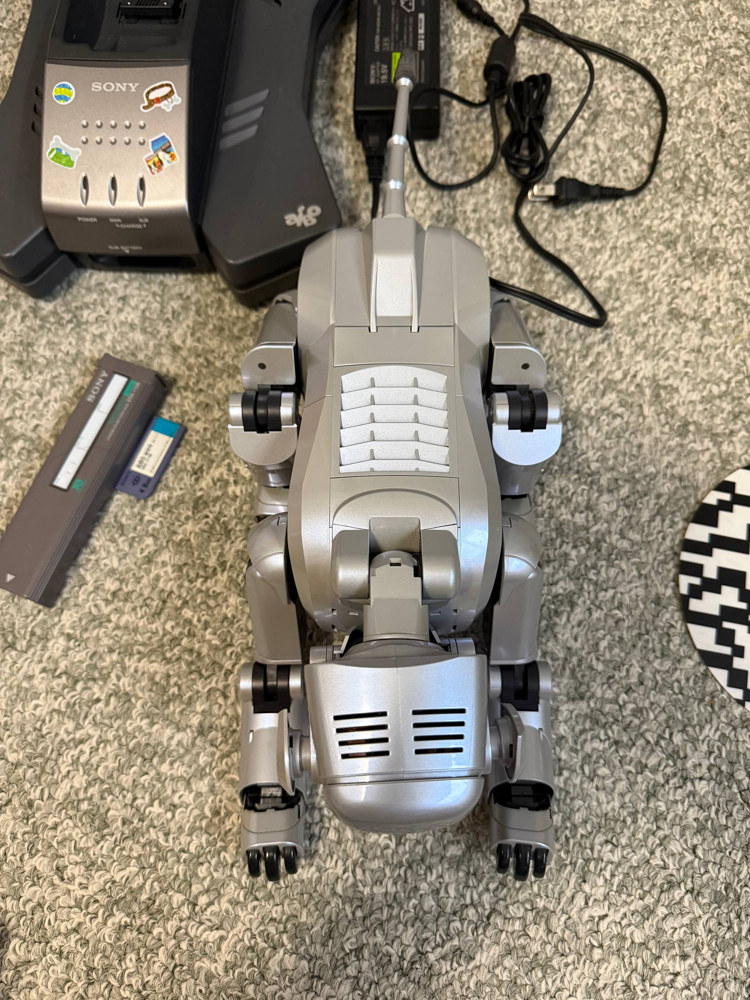
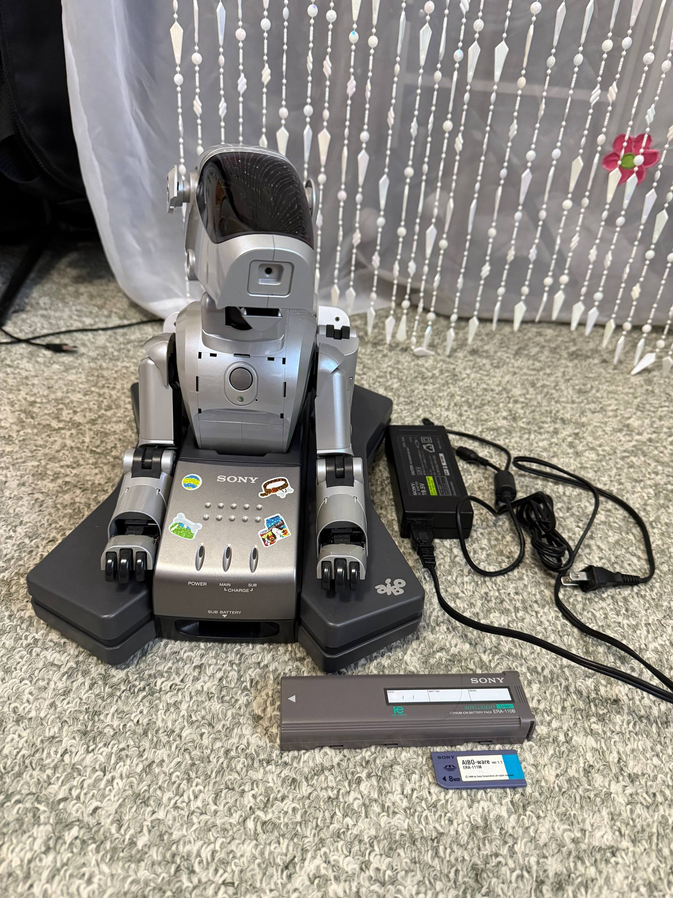
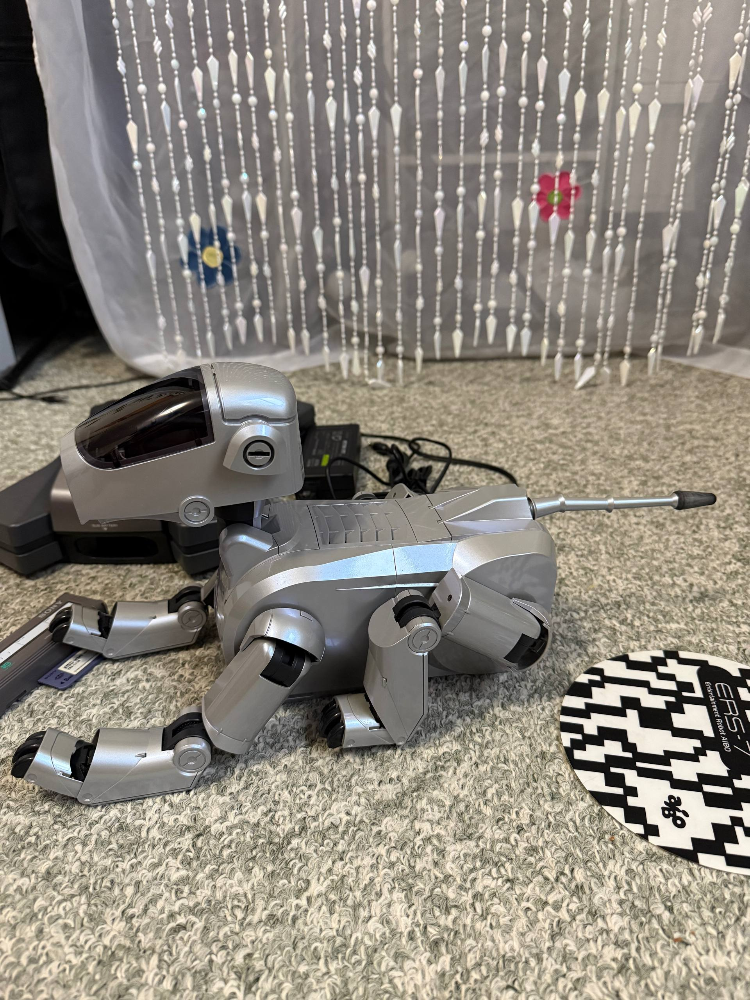
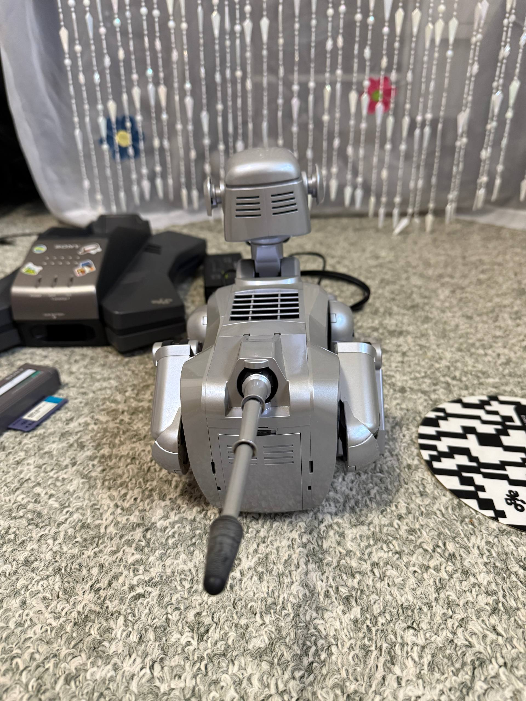
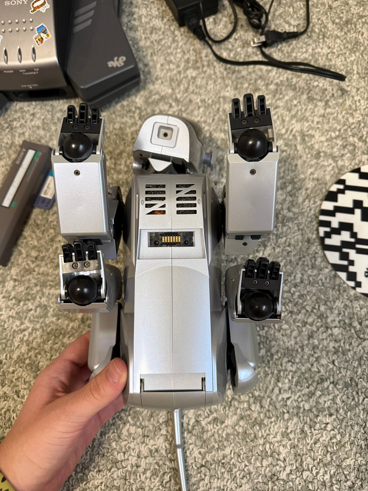
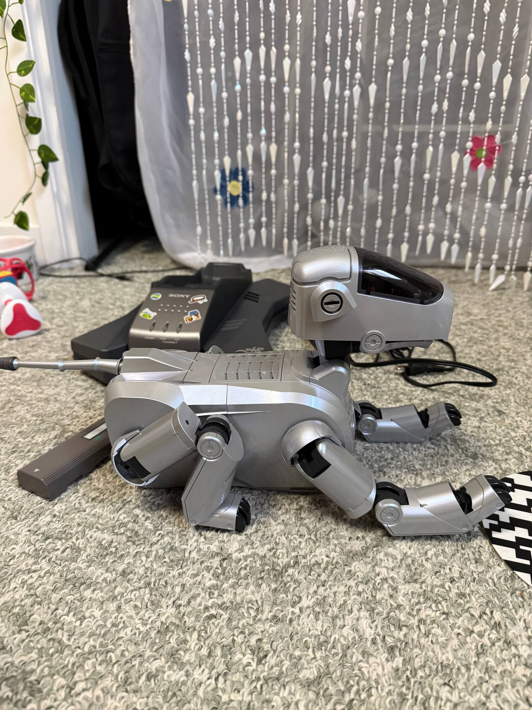

## Renewed experience

An ERS-111 in full working order, no problems, original working battery that still works for 50+ minute, original charging station, Memory Stick, and spare gears for the legs (4 pieces), with its original box.

## Images and videos

| File | Type |
| --- | --- |
|  | Image |
|  | Image |
|  | Image |
|  | Image |
|  | Image |
|  | Image |
|  | Video |
|  | Video |

